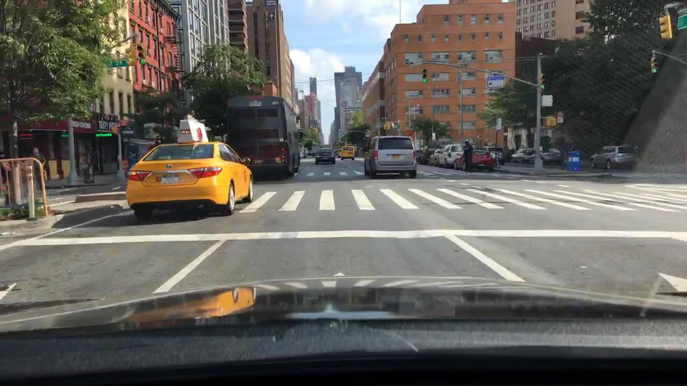
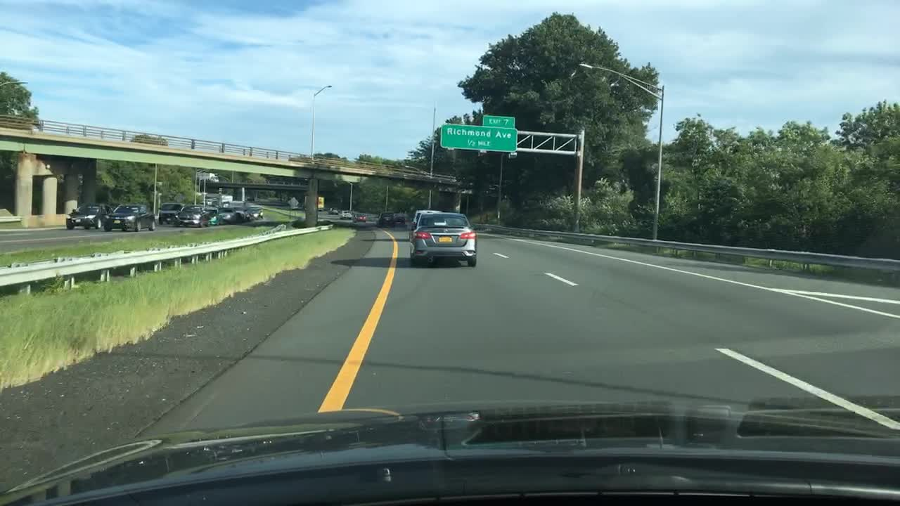
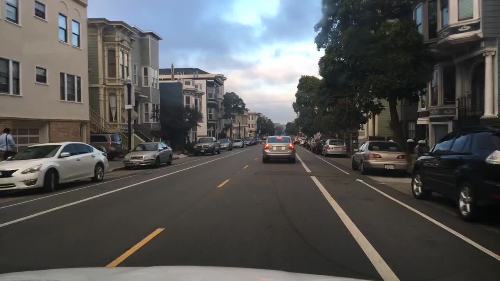
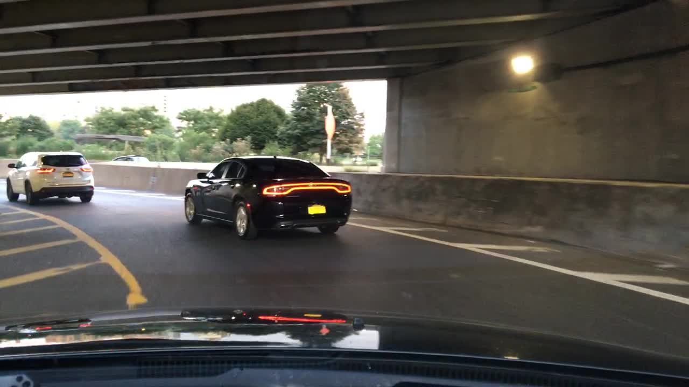
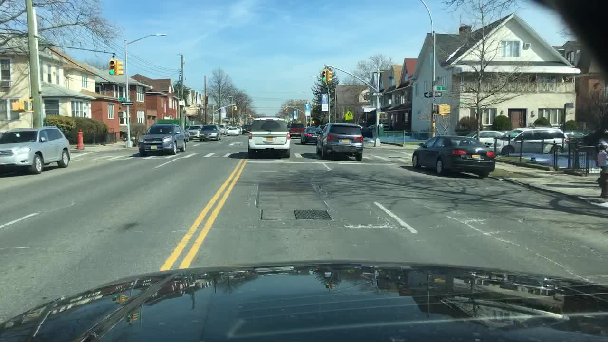
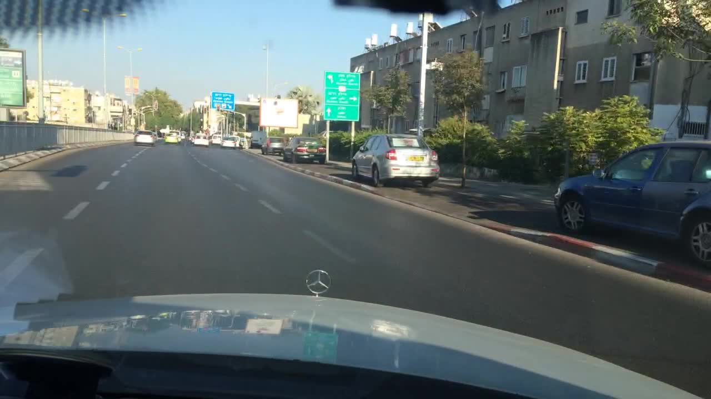

# Annotation guideline — Drivable Area tại ranh giới mặt đường, vỉa hè và lề đường

**Version:** v3

---

## 1. Objective + scope

- **Mục tiêu downstream:** Cung cấp bản đồ vùng không gian mặt đường xe có thể lưu thông (free-space & drivable area) cho hệ thống lập kế hoạch đường đi (Path Planning) và Nhận thức (Perception) của xe tự hành (Ego vehicle). Mục tiêu tối thượng là đảm bảo xe di chuyển đúng phần đường hợp pháp, **tuyệt đối không lập quỹ đạo lấn vào vỉa hè, lối đi bộ hay không gian dành riêng cho người đi bộ**.
- **Trong scope (Bắt buộc gắn nhãn):**
  - Mặt đường xe chạy mà xe ego đang lưu thông trực tiếp (`direct`).
  - Các làn xe cùng chiều bên cạnh mà ego có thể chuyển làn sang hợp pháp (`alternative`).
  - Khu vực vỉa hè (Sidewalk) dành riêng cho người đi bộ ở hai bên đường.
- **Ngoài scope (Bỏ qua - IGNORE, không vẽ):**
  - Đảo phân cách nổi, bồn hoa cây xanh.
  - Làn đường ngược chiều bị ngăn bởi vạch vàng liền (đơn hoặc kép) hoặc dải phân cách.
  - Lối đi bộ riêng biệt hoặc phần chuyển tiếp vỉa hè được hạ thấp cho người đi bộ sang đường (curb cut / pedestrian ramp).
  - Vùng thân xe và gầm xe của các phương tiện đang đỗ tĩnh dọc lề đường.
  - Khu vực rào chắn công trường, phía sau hàng cọc tiêu phân luồng.

---

## 2. Annotation unit

- **Loại dữ liệu:** Ảnh tĩnh 2D (Static Image) độ phân giải 1280×720 trích xuất từ camera trước của xe.
- **Đơn vị gắn nhãn:** Phân đoạn vùng (Region-based Semantic Instance) bằng công cụ **Polygon**.
- **Quy tắc tách phân đoạn (Region Separation):**
  - Làn `direct` (làn xe đang đi) và mỗi làn `alternative` (làn thay thế) tách biệt phải được vẽ thành các polygon riêng biệt.
  - Tuyệt đối không gộp nhiều làn đường bị ngăn cách bởi dải phân cách hoặc hàng xe đỗ thành một polygon duy nhất.
  - Không vẽ polygon tự cắt chéo (Self-intersecting polygon).

---

## 3. Geometry rule

- **Độ chính xác hình học (Geometry Tolerance):**
  - Biên của polygon phải bám sát ranh giới mặt đường nhìn thấy / chân đá bó vỉa (Curb base) hoặc mép vạch sơn kẻ đường với sai lệch **không quá 3 pixel** ở độ phân giải gốc 1280×720.
  - Tại các khúc cua hoặc vạch kẻ cong: Phải đặt nhiều điểm neo liên tiếp để biên polygon cong mượt mà, không cắt góc (Cut corners).
- **Quy tắc Visible Surface (Chỉ vẽ phần mặt đường nhìn thấy):**
  - **Mọi phương tiện (đang di chuyển hoặc đỗ tĩnh) & Người đi bộ:** Tuyệt đối KHÔNG vẽ polygon bao trùm lên đối tượng (không luồn vào gầm xe hay chân người). Polygon phải lượn vòng qua hoặc dừng lại ở rìa bánh xe/thân xe/chân người để chừa các đối tượng này ra khỏi mặt đường.
  - **Điểm tụ / Đường chân trời:** Dừng polygon tại vị trí đường chân trời hoặc điểm xa nhất mắt thường còn phân biệt được mặt đường rõ ràng; không kéo polygon vượt quá đường chân trời lên nền trời.
- **Quy tắc không gian (Spatial Rule) xử lý trạng thái Ego Vehicle:**
  - Không phân biệt xe Ego đang đỗ hay đang di chuyển. Hệ thống chỉ quan tâm "Xe đang nằm ở đâu".
  - **Làn mà xe đang đứng/chạy lên trên:** Mặc định LUÔN LUÔN là `direct`. Dù xe Ego đang đỗ trên làn đỗ xe bên phải, thì không gian ngay trước mũi xe vẫn là hướng đi trực tiếp của nó.
  - **Làn bên cạnh (Làn đường chính):** Được gán là `alternative`. Khi xe Ego muốn hòa vào dòng giao thông từ chỗ đỗ, Path Planning sẽ tự tính quỹ đạo lách từ `direct` sang `alternative` bên trái.

---

## 4. Taxonomy

## 4. Taxonomy

Hệ thống nhãn trên CVAT gồm 4 Class Polygon độc lập (để có màu hiển thị khác nhau) và 1 Class Tag cho mức ảnh:

### 4.1 Class: `direct_drivable` (Type: `polygon`)
Làn đường mà xe ego hiện đang lưu thông trên đó, có quyền ưu tiên đi thẳng.
- **Thuộc tính `needs_review`** (Checkbox, Default: `false`): Đánh dấu `true` khi nghi ngờ ranh giới do bóng râm, góc khuất.

### 4.2 Class: `alternative_drivable` (Type: `polygon`)
Làn đường cùng chiều mà xe ego có thể chuyển làn hợp pháp sang đó mà không vi phạm vạch kẻ liền.
- **Thuộc tính `needs_review`** (Checkbox, Default: `false`): Như trên.

### 4.3 Class: `uncertain_area` (Type: `polygon`)
Vùng mặt đường nhìn thấy nhưng không đủ bằng chứng vạch kẻ/biển báo để khẳng định chắc chắn là direct hay alternative.
- **Thuộc tính `needs_review`** (Checkbox, Default: `false`): Như trên.

### 4.4 Class: `sidewalk` (Type: `polygon`)
Bề mặt vỉa hè được nâng cao hoặc lót gạch dành riêng cho người đi bộ.
- Bắt buộc vẽ ranh giới tách biệt hoàn toàn (không đè lên) polygon của đường xe chạy.

### 4.5 Class: `review_required` (Type: `tag`)
Gắn nhãn tag cho toàn bộ ảnh khi điều kiện môi trường hoặc chất lượng ảnh không cho phép gán nhãn đáng tin cậy.
- **`reason`** (Select, Default: `__undefined__`):
  - `severe_weather_snow_rain`: Mưa lớn/tuyết phủ che mất hoàn toàn mặt đường.
  - `zero_visibility`: Quá tối, loá đèn pha ngược chiều, không thấy ranh giới mặt đường.
  - `unclear_road_boundary`: Không có vạch kẻ, không có curb, không thể xác định mép đường an toàn.
  - `conflicting_evidence`: Biển báo, vạch kẻ hoặc luồng giao thông mâu thuẫn trực tiếp.

---

## 5. Inclusion / exclusion

| Đối tượng / Vùng quan sát | Quyết định gán nhãn | Quy tắc chi tiết |
|---|---|---|
| Làn đường hiện tại của ego | **LABEL** (`direct_drivable`) | Vẽ polygon kín toàn bộ làn/vùng xe ego đang nằm trên (cả khi xe đang đỗ). |
| Làn cùng chiều bên cạnh | **LABEL** (`alternative_drivable`) | Vẽ polygon riêng cho làn bên cạnh, ngăn cách bởi vạch đứt. |
| Vạch đi bộ qua đường (Crosswalk) | **LABEL** (Trùm qua) | Giữ nguyên polygon `direct`/`alternative` chạy trùm qua vạch ngựa vằn. |
| Vạch dừng xe (Stop line) | **LABEL** (Trùm qua) | Polygon phủ trùm qua vạch dừng xe. |
| Giao lộ / Ngã tư thông thoáng | **LABEL** (`direct_drivable` / `uncertain_area`) | Làn đi thẳng phỏng đoán là `direct_drivable`; vùng ngã rẽ rộng là `alternative_drivable` hoặc `uncertain_area`. |
| Vỉa hè (Sidewalk) | **LABEL** (`sidewalk`) | Vẽ polygon bám sát theo phần đường dành cho người đi bộ. Không trèo xuống mặt đường xe chạy. |
| Đảo nổi bê tông, bồn cây | **IGNORE** (Không vẽ) | Bỏ qua các đối tượng kiến trúc khác. |
| Làn đường ngược chiều | **IGNORE** (Không vẽ) | **Critical!** Tuyệt đối không vẽ lấn qua tim đường / vạch vàng kép. |
| Dải phân cách mềm (vạch chéo cấm đè) | **IGNORE** (Không vẽ) | Bo viền polygon ngoài vùng sơn mắt võng / vạch sọc chéo. |
| Mọi phương tiện (đang chạy / đỗ) và Người đi bộ | **IGNORE** phần bị chiếm | Dừng và bo viền polygon theo mép ngoài của đối tượng. Tuyệt đối không vẽ trùm qua gầm xe hay chân người (kể cả ban đêm). |
| Hàng cọc tiêu công trường / Rào chắn | **IGNORE** vùng sau rào | Dừng polygon phía ngoài hàng cọc tiêu phản quang. |
| Dải lề đường cao tốc (Shoulder ngoài vạch trắng liền) | **IGNORE** (Không vẽ) | Dải bê tông/nhựa ngoài vạch liền không phải làn lưu thông và không phải vỉa hè; không gán drivable hay sidewalk. |
| Sân cây xăng / Bãi đỗ xe tư nhân sau vỉa hè | **IGNORE** (Không vẽ) | Khu vực dịch vụ ngoài hành lang đường bộ, không vẽ polygon drivable. |

---

## 6. Visibility / occlusion

- **Bị che khuất bởi cần gạt nước kính lái / Giọt mưa lớn (ví dụ BDD17):**
  - Nếu cần gạt nước hoặc giọt nước che một góc kính nhưng mắt thường vẫn nhìn rõ phần mặt đường bên ngoài: Tiếp tục vẽ mặt đường nhìn thấy.
  - Vùng bị che hoàn toàn không nhìn thấy mặt đường bên dưới: Dừng mép polygon tại rìa vùng che khuất.
- **Ban đêm / Vùng tối (ví dụ BDD18):**
  - Giảm thanh trượt **Opacity** trong CVAT (Sidebar phải > Appearance > Opacity) xuống 20–30% để nhìn rõ ranh giới lề đường và vạch phản quang.
  - Nếu bóng tối quá sâu không thể nhận biết lề đường trong phạm vi 10 pixel, dừng polygon ở vùng còn nhìn thấy được bằng mắt thường.
- **Tuyết phủ / Bùn đất (ví dụ BDD23, BDD24):**
  - Nếu tuyết phủ một phần nhưng vẫn thấy rõ vệt bánh xe lưu thông (tire tracks), vẽ làn `direct` bám theo vệt bánh xe.
  - Nếu tuyết phủ dày kín > 70% mặt đường, không còn thấy tim đường hoặc ranh giới an toàn: **Dừng vẽ và gắn Tag `review_required` với lý do `severe_weather_snow_rain`**.
- **Bóng râm toà nhà / Cây cối:** Bóng râm không làm thay đổi chức năng đường — Tiếp tục vẽ polygon trùm qua bóng râm bám theo mép đường thực tế.

---

## 7. Ambiguity / escalation

Annotator tuân thủ quy tắc 4 trạng thái quyết định sau:

1. **LABEL:** Khi có đầy đủ bằng chứng nhận diện (vạch kẻ rõ ràng, lề đường rõ, hướng đi cùng chiều).
2. **IGNORE (Bỏ qua):** Khi đối tượng là vỉa hè, làn ngược chiều, chướng ngại vật cố định theo mục 5.
3. **UNKNOWN:** Khi biết chắc là vùng mặt đường xe chạy được, nhưng tại vị trí giao nhau phức tạp hoặc vạch kẻ bị mờ đứt đoạn không thể phân định chắc chắn giữa `direct` và `alternative`.
   - *Cách thể hiện trong CVAT:* Vẽ polygon với thuộc tính `areaType = uncertain`.
4. **ESCALATE (Báo cáo cấp trên):** Khi toàn bộ ảnh hoặc vùng quan sát bị cản trở nghiêm trọng (thời tiết khắc nghiệt, camera hư hỏng, tuyết phủ kín mặt đường, công trường xung đột không có lối đi).
   - *Cách thể hiện trong CVAT:* Nhấn công cụ **Setup tag** (bên trái) > Chọn nhãn **`review_required`** > Chọn thuộc tính `reason` phù hợp và bấm **Tag**.

---

## 8. Temporal rule

- **Quy tắc:** Không áp dụng — Đây là bài toán xử lý ảnh tĩnh 2D (Static Image Task). Mỗi ảnh được gán nhãn độc lập, không sử dụng Track qua video.

---

## 9. Examples

Dưới đây là các ảnh ví dụ mẫu trong tập dữ liệu (thuộc split `example` và `calibration`):

| sample_id | Cảnh quan sát | Expected output | Quy tắc áp dụng |
|---|---|---|---|
| `BDD01` | Cao tốc ban ngày, 3 làn cùng chiều | 1 polygon `direct` (làn giữa xe đang chạy), 2 polygon `alternative` (2 làn trái và phải). Không vẽ dải phân cách bê tông. | Mục 1 & 4: Tách rời từng làn thành các polygon độc lập. |
| `BDD02` | Đường phố ban ngày, có vỉa hè hai bên | 1 polygon `direct` bám sát chân bó vỉa bên phải và vạch kẻ tim đường bên trái. Vỉa hè bỏ qua. | Mục 3 & 5: Dừng sát chân đá bó vỉa (Curb), dung sai ≤ 3px. |
| `BDD03` | Cao tốc cong, vạch sơn rõ | 1 polygon `direct`, 2 polygon `alternative`. Biên uốn lượn mượt theo vạch cong. | Mục 3: Bo mượt các đoạn đường cong bằng nhiều điểm neo. |
| `BDD10` | Phố nội đô, xe ô tô đỗ kín lề bên phải | 1 polygon `direct` ở giữa; mép phải bo sát sườn hàng xe đang đỗ. Không vẽ luồn vào gầm xe đỗ. | Mục 5: Xe đỗ tĩnh bên lề là Non-drivable. |
| `BDD16` | Hầm chui, ánh sáng chuyển từ sáng sang tối | Polygon `direct` kéo dài vào trong hầm tới điểm cuối nhìn thấy rõ vách hầm và vạch phân làn. | Mục 6: Dừng tại điểm giới hạn nhìn rõ; giảm Opacity để quan sát. |

### Ảnh minh họa

`BDD01` — tách từng làn; vùng sọc chéo bên phải và barrier bê tông không vẽ.

`BDD02` — polygon phủ trùm vạch đi bộ; mép phải dừng tại chân bó vỉa.

`BDD03` — biên polygon uốn theo vạch cong; vạch vàng bên trái là lề, không vẽ ra cỏ và guardrail.

`BDD10` — mép phải bo theo sườn hàng xe đỗ, không luồn vào gầm xe.

`BDD16` — kéo polygon vào vùng còn thấy vạch dưới gầm cầu; dừng khi vách và vạch không còn rõ.

---

## 10. Common mistakes

1. **Lấn sang làn đối diện (Critical Error):** Vẽ polygon trùm qua vạch vàng kép sang làn ngược chiều. ➔ *Khắc phục:* Luôn tìm vạch tim đường và hướng đầu xe đối diện trước khi hạ bút vẽ biên trái.

   `BDD07` — vạch vàng kép nằm giữa; xe đối diện ở bên trái vạch. Biên trái của `direct` dừng tại mép phải vạch vàng, không phủ sang làn kia.

   

2. **Trèo lên vỉa hè hoặc đảo giao thông (Critical/Major Error):** Kéo góc polygon vượt lên trên gờ bó vỉa. ➔ *Khắc phục:* Phóng to ảnh (Zoom) và hạ điểm chính xác tại chân mép đá bó vỉa.

   `BDD15` — bó vỉa sơn đỏ-trắng bên phải. Polygon làn dừng tại chân bó vỉa; xe đỗ nằm sau bó vỉa nên không kéo polygon tới thân xe.

   

3. **Vẽ lấn vào gầm xe đỗ bên đường:** ➔ *Khắc phục:* Chỉ coi làn đường thông thoáng là drivable; hàng xe đỗ là vật cản tĩnh, phải bo viền ngoài thân xe.

   `BDD10` — hàng xe đỗ sát lề. Mép polygon đi theo sườn ngoài thân xe, chừa gầm xe ra ngoài.

   

4. **Cắt đứt polygon tại vạch người đi bộ (Crosswalk):** Nhầm vạch ngựa vằn là vùng cấm đi. ➔ *Khắc phục:* Vạch đi bộ vẫn là mặt đường cho xe chạy khi có quyền ưu tiên, polygon phải vẽ phủ trùm qua.

   `BDD02` — vạch ngựa vằn ngang mặt đường. Polygon `direct` chạy liên tục qua vạch, không tách thành hai mảnh tại crosswalk.

   

5. **Vẽ chung 2 làn tách biệt thành 1 polygon:** ➔ *Khắc phục:* Mỗi dải đường rời rạc bắt buộc phải bấm nút **Done (N)** để tạo một polygon riêng biệt.

   `BDD01` — các làn cùng chiều tách bởi vạch trắng. Mỗi làn một polygon; vùng sọc chéo bên phải là polygon riêng bị bỏ qua, không gộp vào làn cạnh nó.

   
